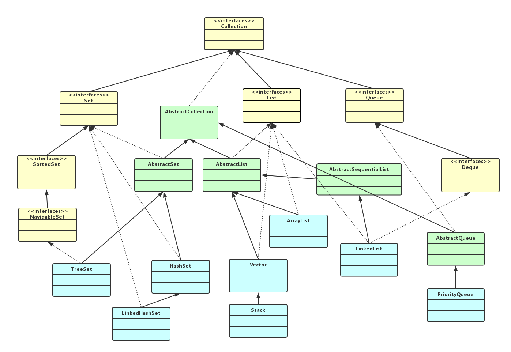
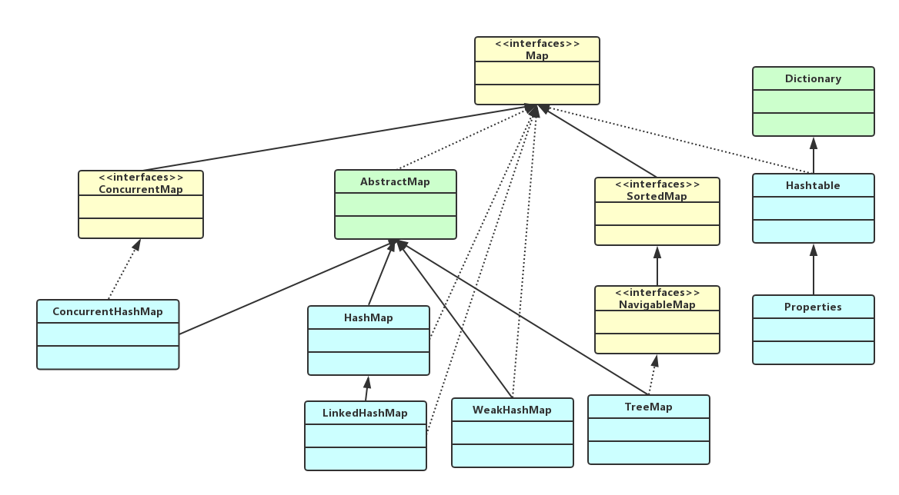

##### 1.集合类简介
    Java集合位于java.util包下，集合里面存放的是对象的引用，而不是对象的本身。
    集合类型主要包括Collection和Map接口，Collection接口是存放单值最大的接口，Map接口是存放映射关系最大的接口。
    
    Collection主要子接口包括：
    set（集）：不能存放重复的内容，所有重复的内容靠hashCode()和equals()两个方法区分；
    list（列表）：可以存放重复的内容；
    Queue(队列)：队列接口；
    SortedSet（有序集）：可以对集合中的数据进行排序。
    Map主要子接口包括：
    HashMap：无序存放，key不允许重复；
    TreeMap：有序存放，按照集合key值进行排序，key值不允许重复；
    IdentityHashMap：key值可以重复。
    
##### 2.Java集合Collection接口UML图

##### 3.Java集合Map接口UML图

##### 4.集合类实现
    1.集合类实现
    基于双向循环链表实现：LinkedList
    基于动态数组实现：ArrayList、Vector
    基于数组+单链表实现：HashMap、HashSet、Hashtable、currentHashMap
    基于红黑树实现：TreeMap、TreeSet
    基于哈希表+双向链表实现：LinkedHashMap、LinkedHashSet
    基于最小堆实现：PriorityQueue

    2.集合类是否线程安全
    线程安全：Hashtable(线程安全的HashMap)、Vector(线程安全的ArrayList)、currentHashMap(替代Hashtable)
    允许存放null值：
    list、map、set、vector等集合类型都是可以存放null的。
    不允许存放null值：
    Hashtable不允许null，Dictionary 线程安全 
    	ConcurrentHashMa不允许为null，AbstractMap 分段锁技术 
    	TreeMap不允许为null，AbstractMap线程不安全
    	
---

##### 1.SortedSet(接口)
    位于包java.util下面。是java.util.Set的子接口，实现类为TreeMap。
    Set接口本身不具备排序功能，提供SortedMap接口可以提供排序的接口，同时提供可以获取特点位置元素的方法。
##### 2.TreeSet(类)
    TreeSet继承了AbstractSet抽象类，实现了NavigableSet接口。
    TreeSet只能存放引用类型，存储元素不重复但有序，当存入自定义引用类型时候就要考虑元素不重复的特性，必须实现Comparable接口，在TreeSet内部会自动调用存储的引用类型对象实现的Comparable中的compareTo方法，不实现会报错。
    当把一个对象加入TreeSet集合中时，TreeSet调用该对象的compareTo(Object obj)方法与容器中的其他对象比较大小，然后根据红黑树算法决定它的存储位置。
    TreeSet是基于TreeMap实现的，TreeSet中元素支持2中排序算法，自然排序和自定义排序。
##### 3.HashSet(类)
    HashSet是基于HashMap来实现的，使用了HashMap的key来实现各种特性。基于Hash表实现。
##### 4.LinkedHashSet(类)
    LinkedHashSet继承于 HashSet，基于 LinkedHashMap 来实现的。
    与 HashSet 的不同之处在于，除了哈希表，LinkedHashSet 维护着一个运行于所有条目的双向列表。此链接列表定义了迭代顺序，该迭代顺序可为插入顺序或是访问顺序。
##### 5.Vector(类)
    Vector作为List的另外一个典型实现类，完全支持List的全部功能，Vector类也封装了一个动态的，允许在分配的Object[]数组，Vector是一个比较古老的集合，JDK1.0就已经存在，建议尽量不要使用这个集合，Vector与ArrayList的主要是区别是，Vector是线程安全的，但是性能比ArrayList要低。
##### 6.Stack(类)
    stack是在Java.util这个包里，继承Vector类。
##### 7.ArrayList(类) [Java集合类-ArrayList](arraylist/ArrayList.md)  
    ArrayList是基于数组实现的，是一个动态数组，其容量能自动增长，类似于C语言中的动态申请内存，动态增长内存。
    ArrayList不是线程安全的，只能用在单线程环境下，多线程环境下可以考虑用Collections.synchronizedList(List l)函数返回一个线程安全的ArrayList类，也可以使用concurrent并发包下的CopyOnWriteArrayList类。
    ArrayList实现了Serializable接口，因此它支持序列化，能够通过序列化传输，实现了RandomAccess接口，支持快速随机访问，实际上就是通过下标序号进行快速访问，实现了Cloneable接口，能被克隆。
    每个ArrayList实例都有一个容量，该容量是指用来存储列表元素的数组的大小。它总是至少等于列表的大小。随着向ArrayList中不断添加元素，其容量也自动增长。自动增长会带来数据向新数组的重新拷贝，因此，如果可预知数据量的多少，可在构造ArrayList时指定其容量。在添加大量元素前，应用程序也可以使用ensureCapacity操作来增加ArrayList实例的容量，这可以减少递增式再分配的数量。 
    注意，此实现不是同步的。如果多个线程同时访问一个ArrayList实例，而其中至少一个线程从结构上修改了列表，那么它必须保持外部同步。
##### 8.LinkedList(类) [Java集合类-LinkedList](linkedlist/LinkedList.md)  
    LinkedList底层的数据结构是基于双向循环链表。
##### 9.PriorityQueue(类)
    PriorityQueue内部其实就是采用最小堆的算法来管理的。
    PriorityQueue的逻辑结构是一棵完全二叉树，存储结构其实是一个数组。逻辑结构层次遍历的结果刚好是一个数组。
##### 10.SortedMap(接口)
    SortedMap也是一个接口，继承于Map接口，Sorted表示它是一个有序的键值映射。
    SortedMap的排序方式有两种：自然排序和指定比较器排序。插入有序的SortedMap的所有元素都必须实现Comparable接口（或被指定的比较器所接受）。
##### 11.TreeMap(类)
    TreeMap的结构是红黑树又称红-黑二叉树，它首先是一颗二叉树，它具体二叉树所有的特性。同时红黑树更是一颗自平衡的排序二叉树。
    get put remove等方法的时间复杂度为log(n)。
##### 12.HashMap(类)
    HashMap 是 Map 的一个实现类，它代表的是一种键值对的数据存储形式。Key 不允许重复出现，Value 随意。jdk 8 之前，其内部是由数组+单链表来实现的，而 jdk 8 对于链表长度超过 8 的链表将转储为红黑树。
    哈希表（hash table）也叫散列表，是一种非常重要的数据结构，应用场景及其丰富，许多缓存技术（比如memcached）的核心其实就是在内存中维护一张大的哈希表。
##### 13.Hashtable(类)
    和HashMap一样，Hashtable 也是一个散列表，它存储的内容是键值对(key-value)映射。
    Hashtable 继承于Dictionary，实现了Map、Cloneable、java.io.Serializable接口。
    Hashtable 的函数都是同步的，这意味着它是线程安全的。它的key、value都不可以为null。此外，Hashtable中的映射不是有序的。
    HashTable因为内部是采用synchronized来保证线程安全的。
##### 14.LinkedHashMap(类)
    LinkedHashMap 是 Map 接口的哈希表和双向链表实现。
    LinkedHashMap 实现与 HashMap 的不同之处在于，LinkedHashMap 维护着一个运行于所有条目的双重链接列表。此链接列表定义了迭代顺序，该迭代顺序可以是插入顺序或者是访问顺序。此实现不是同步的。
##### 15.WeakHashMap(类)
    WeakHashMap 继承于AbstractMap，实现了Map接口。
    和HashMap一样，WeakHashMap 也是一个散列表，它存储的内容也是键值对(key-value)映射，而且键和值都可以是null。
    不过WeakHashMap的键是“弱键”。在 WeakHashMap 中，当某个键不再正常使用时，会被从WeakHashMap中被自动移除。更精确地说，对于一个给定的键，其映射的存在并不阻止垃圾回收器对该键的丢弃，这就使该键成为可终止的，被终止，然后被回收。某个键被终止时，它对应的键值对也就从映射中有效地移除了。
    这个“弱键”的原理呢？大致上就是，通过WeakReference和ReferenceQueue实现的。 WeakHashMap的key是“弱键”，即是WeakReference类型的；ReferenceQueue是一个队列，它会保存被GC回收的“弱键”。实现步骤是：
    (01) 新建WeakHashMap，将“键值对”添加到WeakHashMap中。实际上，WeakHashMap是通过数组table保存Entry(键值对)；每一个Entry实际上是一个单向链表，即Entry是键值对链表。
    (02) 当某“弱键”不再被其它对象引用，并被GC回收时。在GC回收该“弱键”时，这个“弱键”也同时会被添加到ReferenceQueue(queue)队列中。
    (03) 当下一次我们需要操作WeakHashMap时，会先同步table和queue。table中保存了全部的键值对，而queue中保存被GC回收的键值对；同步它们，就是删除table中被GC回收的键值对。这就是“弱键”如何被自动从WeakHashMap中删除的步骤了。
    和HashMap一样，WeakHashMap是不同步的。可以使用 Collections.synchronizedMap 方法来构造同步的 WeakHashMap。
##### 16.Properties(类)
    Properties是Hashtable集合的子类，也是线程安全的。
    Properties 类表示了一个持久的属性集。Properties 可保存在流中或从流中加载。属性列表中每个键及其对应值都是一个字符串。
##### 17.IdentityHashMap(类)
    IdentityHashMap比较key时是“引用相等”而HashMap是“对象相等”；
    对于k1和k2，当k1==k2时，IdentityHashMap认为两个key相等；
    而HashMap只有在k1.equals(k2) == true 时才会认为两个key相等。
##### 18.currentHashMap(类)
    ConcurrentHashMap是Java5中新增加的一个线程安全的Map集合，可以用来替代HashTable。使用了多个锁代替HashTable中的单个锁，也就是锁分离技术（Lock Stripping）.
##### 19.NavigableMap(接口)
    NavigableMap 增加了一些方法用于TreeMap。
    NavigableSet扩展了 SortedSet，具有了为给定搜索目标报告最接近匹配项的导航方法。方法 lower、floor、ceiling 和 higher 分别返回小于、小于等于、大于等于、大于给定元素的元素，如果不存在这样的元素，则返回 null。类似地，方法 lowerKey、floorKey、ceilingKey 和 higherKey 只返回关联的键。所有这些方法是为查找条目而不是遍历条目而设计的。
    可以按照键的升序或降序访问和遍历 NavigableMap。descendingMap 方法返回映射的一个视图，该视图表示的所有关系方法和方向方法都是逆向的。升序操作和视图的性能很可能比降序操作和视图的性能要好。subMap、headMap 和 tailMap 方法与名称相似的 SortedMap 方法的不同之处在于：可以接受用于描述是否包括（或不包括）下边界和上边界的附加参数。任何 NavigableMap 的 Submap 必须实现 NavigableMap 接口。
    此外，此接口还定义了 firstEntry、pollFirstEntry、lastEntry 和 pollLastEntry 方法，它们返回和/或移除最小和最大的映射关系（如果存在），否则返回 null。
    subMap(K, K)、headMap(K) 和 tailMap(K) 方法被指定为返回 SortedMap，以允许现有 SortedMap 实现能相容地改进为实现 NavigableMap，但鼓励此接口的扩展和实现重写这些方法以返回 NavigableMap。类似地，可以重写 SortedMap.keySet() 以返回 NavigableSet。
